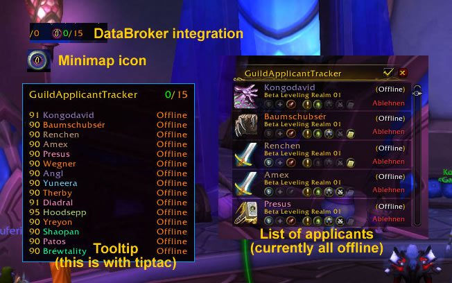

# GuildApplicantTracker (WoW AddOn)

&nbsp; &nbsp; &nbsp; &nbsp;

## Description
Blizzard give us the guild browser but too tiny indicator outside the guild window. You must open the guild window to see more.

This addon closing this hole. It display the count of applicants on panels like TitanPanel and offer a simple window with a list of applcants and you can accecpt or decline a applicant without opne the guild window.

## Please use for
- Bug reports & feature requests > the issues tracker on project page
- Comments & Criticism > the comment area on addon page

## LibDataBroker integration + Minimap button
- Left click on broker button - Show/Hide tracker frame.
- Right click on broker button - Show option menu.

## Chat command / Commandline options
**Usage:**

`/gat <command>`

You can use it without a command to get the list of available commands

**Available commands:**

- toggle | Show/Hide tracker frame.
- options | Show/Hide option panel.
- minimap | Show/Hide minimap icon.
- resetsettings | Reset addon settings.
- resetframe | Reset tracker frame position.

## Localization
[Localization tool](https://www.curseforge.com/wow/addons/guildapplicanttracker/localization) is open and needs some input.

## Credits
For translation: Thanks at Bullseiify(deDE).

## My other projects
* [On Curseforge](https://www.curseforge.com/members/hizuro_de/projects)
* [On Github](https://github.com/HizurosWoWAddOns?tab=repositories)

## Disclaimer
> World of Warcraft© and Blizzard Entertainment© are all trademarks or registered trademarks of Blizzard Entertainment in the United States and/or other countries. These terms and all related materials, logos, and images are copyright © Blizzard Entertainment.
